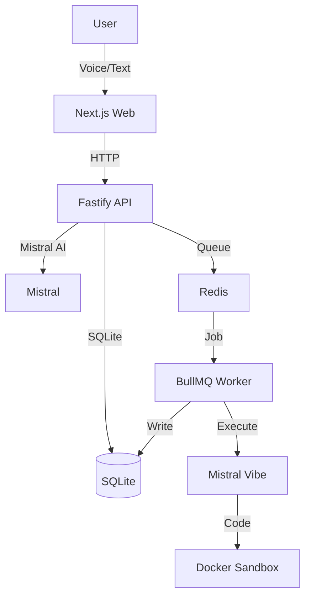

# ⬡ The Architect

**Voice-first AI technical cofounder for hackathons and fast product execution.**

Build faster with an AI that thinks like a senior architect. Speak your idea, get technical decisions, architecture docs, and executable code.

---

## Create Your Architecture (Interactive Blueprint)

**The Architect's superpower: Turn ideas into visual architecture in seconds.**

```
┌─────────────────────────────────────────────────────────────┐
│  Architecture Tab                                            │
│  ┌─────────────────────────────────────────────────────┐   │
│  │                                                     │   │
│  │   [React] ──────► [API Gateway] ──────► [Database]  │   │
│  │      │                  │                  │         │   │
│  │      ▼                  ▼                  ▼         │   │
│  │   [State]           [Auth]            [Postgres]   │   │
│  │                                                     │   │
│  └─────────────────────────────────────────────────────┘   │
│                                                             │
│  📐 Generate Blueprint  │  💾 Save Layout  │  📤 Export   │
└─────────────────────────────────────────────────────────────┘
```

**One click → Interactive architecture diagram you can:**
- ✅ Drag and rearrange components
- ✅ Zoom and pan freely
- ✅ Auto-saves your layout
- ✅ Present in meetings

---

## Why The Architect?

| Traditional AI Chat | The Architect |
|---------------------|--------------|
| Generic advice | Context-aware technical decisions |
| Scattered thoughts | Structured artifacts (Architecture, Tasks, Pitch) |
| Manual documentation | Auto-generated `ARCHITECTURE.md`, `TASKS.md` |
| No execution | **Runs code for you** with Vibe CLI |

---

## Features

### Voice-First Input
- Speak naturally, get structured output
- High-accuracy transcription with Mistral Voxtral
- Works in any Chromium browser

### Create Your Architecture
**The killer feature: Visual architecture design with one click.**

1. **Chat with The Architect** about your project idea
2. **Click "Architecture" tab** → **Generate Blueprint**
3. **Get an interactive React Flow diagram** showing:
   - Frontend components
   - Backend services
   - Database connections
   - API boundaries
   - Data flow arrows

**Your architecture becomes a draggable, zoomable diagram you can:**
- Customize node positions (saved automatically)
- Export as image
- Share during presentations

### AI Technical Reasoning
- Real-time technical decisions with tradeoffs
- Architecture recommendations based on your constraints
- Mode-based responses: Architect, Planner, or Pitch

### Auto-Generated Artifacts
- **Architecture** - System design with component diagrams
- **Tasks** - Implementation checklist with priorities
- **Pitch** - Investor-ready value proposition

### Live Code Execution
- **Build with Vibe**: AI writes code in isolated Docker sandbox
- Turbo mode: Parallel agents for faster execution
- Dry-run mode: Preview changes before applying

### Real-Time Updates
- SSE streaming for live build logs
- Artifact generation progress
- Session-based context preservation

---

## Quick Start (5 minutes)

```bash
# 1. Clone & install
git clone https://github.com/your-repo/the-architect.git
cd the-architect
npm install

# 2. Setup environment
cp .env.example .env
# Add your MISTRAL_API_KEY (get one at https://console.mistral.ai)

# 3. Start everything
npm run dev
```

**Then open:** `http://localhost:3000`

---

## Demo Flow

### 1. Describe Your Idea
```
Speak or type: "I want to build a real-time chat app with React and Firebase"
```

### 2. Get Architecture + Blueprint
- The Architect responds with technical decisions
- Click **Architecture** tab → **Generate Blueprint**
- **Interactive React Flow diagram** appears automatically

### 3. Execute (Optional)
- Click **Build with Vibe** to generate actual code
- Watch live as AI writes your application

```
Demo tip: Pre-load a session before your presentation for instant blueprint generation!
```

---

## Tech Stack

| Layer | Technology |
|-------|------------|
| Frontend | Next.js 15, React 19, TypeScript, Tailwind |
| API | Fastify, Zod |
| Queue | BullMQ + Redis |
| Database | SQLite |
| AI | Mistral Large + Voxtral |
| Code Gen | Mistral Vibe (Docker sandbox) |

---

## Project Structure

```
the-architect/
├── apps/
│   ├── web/          # Next.js frontend (port 3000)
│   ├── api/          # Fastify API (port 4000)
│   └── worker/       # BullMQ worker (port 4100)
├── packages/
│   ├── shared-types/ # Zod schemas & types
│   └── core/         # DB, AI, Queue, Docker logic
├── docs/             # Architecture & guides
└── infra/           # Docker Compose
```

---

## Commands

| Command | Description |
|---------|-------------|
| `npm run dev` | Start full stack (API + Worker + Web + Redis) |
| `npm run dev:all -- --force` | Force restart (kills stale processes) |
| `npm run redis:up` | Start Redis only |
| `npm run workflow:docker-loop` | Run integration tests in Docker |
| `npm run typecheck` | TypeScript validation |

---

## Environment Variables

```env
# Required
MISTRAL_API_KEY=your_key_here

# Optional
ELEVENLABS_API_KEY=        # Voice output
SANDBOX_DOCKER_IMAGE=architect-vibe-image  # For code execution
```

---

### Common Issues
- **"MISTRAL_API_KEY not configured"** → Add key to `.env`
- **"Docker not running"** → Start Docker Desktop
- **Ports in use** → Run `npm run dev:all -- --force`

---

## Resources

- [Getting Started Guide](./docs/path.md)
- [API Documentation](./docs/SCHEMA.md)
- [Queue Contracts](./docs/QUEUE.md)
- [Deployment Guide](./docs/DEPLOYMENT.md)

---

## Architecture



---

## License

MIT - Build fast, ship faster.

---

*Built for hackers who want an AI cofounder, not just a chatbot.*
