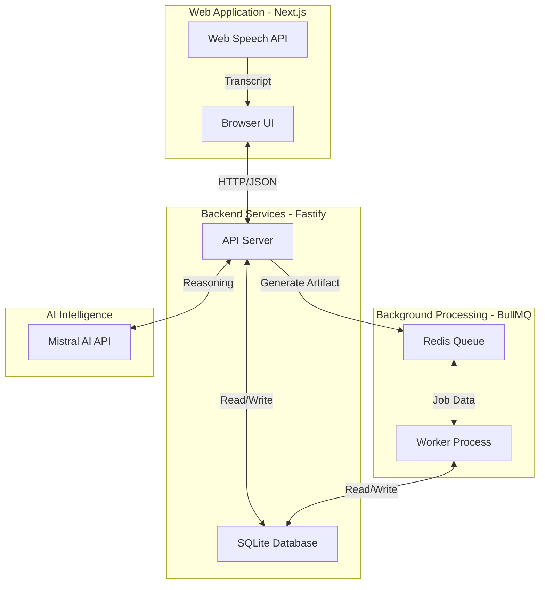
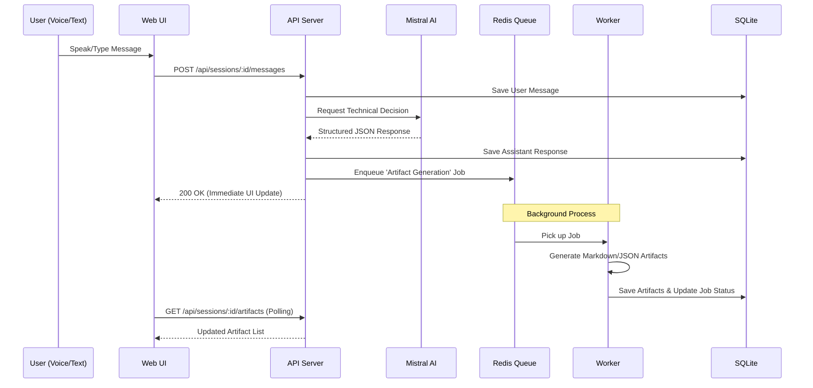

# The Architect

**Voice-first AI technical cofounder for hackathons and fast product execution.**

---

## What it is
The Architect is a real-time assistant that helps builders go from **Idea -> Architecture -> Execution Plan -> Deliverable Artifacts**.

You speak, it responds with:
- **Technical Decisions:** Clear, actionable advice on your tech stack and architecture.
- **Tradeoff Analysis:** Why choosing one tool over another matters for your timeline.
- **Implementation Tasks:** A concrete list of steps to start coding immediately.
- **Exportable Artifacts:** Auto-generated `ARCHITECTURE.md`, `TASKS.md`, and `PITCH.md`.

---

## System Architecture

### Component Map
Shows how the Web UI, API, and Background Worker interact.



### Sequence Diagram: Sending a Message
The step-by-step flow when you speak to The Architect.



---

## Tech Stack
- **Frontend:** Next.js 15, React 19, TypeScript, Tailwind CSS, Lucide Icons.
- **API:** Fastify (Node.js), Zod (Validation).
- **Worker:** BullMQ (Background Jobs).
- **Queue:** Redis (Task storage).
- **Database:** SQLite (Persistent storage).
- **AI Models:** Mistral Large (Reasoning & Structured Output).

---

## Repository Layout
```txt
apps/
  web/      # Next.js Frontend
  api/      # Fastify HTTP API & Orchestration
  worker/   # BullMQ Background Job Processors
packages/
  shared-types/  # Centralized Zod schemas & TS types
  core/          # Shared DB, AI, Queue, and Artifact logic
infra/
  docker-compose.yml  # Redis & local services
docs/
  PRD.md           # Product Requirement Document
  ARCHITECTURE.md  # Detailed Technical Architecture
  path.md          # Start here! Guided tour for developers
```

---

## Quick Start (One Command)

1. **Install dependencies:**
   ```bash
   npm install
   ```

2. **Setup environment:**
   ```bash
   cp .env.example .env
   # Edit .env and add your MISTRAL_API_KEY
   ```
 
3. **Start everything (Redis + API + Worker + Web):**
   ```bash
   npm run dev
   ```

- **Web:** `http://localhost:3000`
- **API Health:** `http://localhost:4000/api/health`
- **Worker Health:** `http://localhost:4100/health`

---

## Voice notes:
- Use a Chromium-based browser for best Web Speech API support.
- The browser will prompt for microphone permission on first recording attempt.
- To enable voice output, set `ELEVENLABS_API_KEY` in `.env`.
- To enable automated build execution, install Mistral Vibe CLI (`vibe`) on the host running the API.

---

## Developer Resources
- **New to the project?** Read [**path.md**](./path.md) for a guided tour of the code.
- **Running Tests:** Use `npm run test:integration` to verify the full loop.
- **Database:** Data is stored in `./data/the-architect.sqlite`.
- **Infrastructure:** Use `npm run redis:up` to start Redis manually with Docker.

---

If this repo is used in a hackathon, prioritize: **Shipping, Reliability, and Demo Clarity** over premature complexity.
