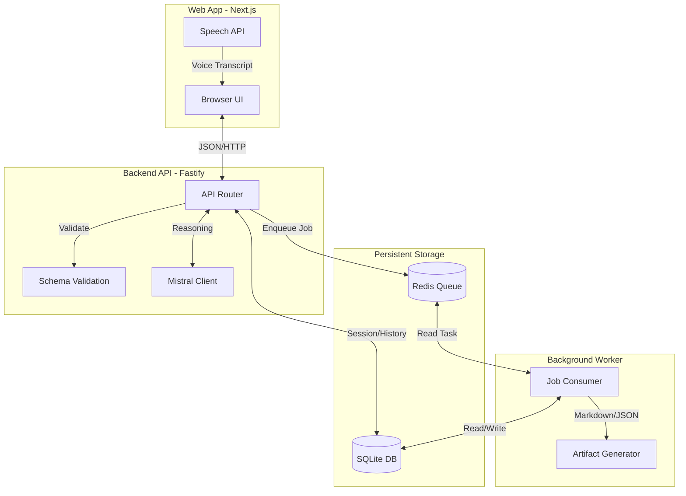

# Architecture - The Architect (MVP)

The Architect is built as a **Monorepo** to ensure tight coupling between the frontend, the backend API, and the background processing logic. This design allows for rapid iteration and ensures that data structures are consistent across all services.

## High-Level Flow

1. **User Input:** The user speaks or types a technical question into the Web UI.
2. **Orchestration:** The API receives the request, stores the message, and asks Mistral AI for a structured technical decision.
3. **Async Generation:** Once the AI responds, the API enqueues a background job via BullMQ to generate long-form technical artifacts.
4. **Processing:** The Worker picks up the job, generates Markdown and JSON artifacts, and saves them to SQLite.
5. **Real-time Feedback:** The Web UI polls for new artifacts and displays them as soon as they are ready.

---

## Component Diagram (Mermaid)

---

## Core Components

### 1) Web Application (`apps/web`)
- **React Components:** Built with React 19 and Next.js 15 for a fast, responsive UI.
- **Voice-First:** Uses a custom `useVoiceTranscript` hook to integrate with the browser's native Speech Recognition API.
- **Dynamic Thread:** Maintains a real-time list of messages and AI responses.

### 2) API Service (`apps/api`)
- **Fastify Framework:** Chosen for its high performance and built-in support for JSON schema validation.
- **Request Validation:** Every request is validated against Zod schemas from `packages/shared-types`.
- **AI Orchestration:** Coordinates calls to Mistral AI and manages the immediate response to the user.

### 3) Worker Service (`apps/worker`)
- **BullMQ Integration:** Efficiently processes background tasks without blocking the main event loop.
- **Artifact Generation:** Uses templates to convert AI data into structured `ARCHITECTURE.md`, `TASKS.md`, or `PITCH.md` files.
- **Error Handling:** Implements automatic retries with exponential backoff for failed jobs.

### 4) Shared Packages
- **`shared-types`:** The "Contract" for the entire system. Contains Zod schemas and inferred TypeScript types.
- **`core`:** The "Library" of the system. Contains shared logic for SQLite (DB), Mistral (AI), and BullMQ (Queue).

---

## Data Model (SQLite)

We use a simple but effective relational schema stored in a single SQLite file:

- **`sessions`:** High-level chat threads.
- **`messages`:** Individual user and assistant messages.
- **`artifacts`:** Generated technical documents.
- **`jobs`:** Status tracking for background artifact generation.

---

## Queue Strategy (BullMQ + Redis)

Background processing is essential for maintaining UI responsiveness.
- **Latency Mitigation:** AI document generation can take 10+ seconds. By moving this to a queue, the user gets an immediate AI "summary" while the full document is prepared in the background.
- **Reliability:** If the database is busy or the worker crashes, the job remains in Redis and will be automatically retried.

---

## Reliability & Performance

- **Graceful Failures:** If Mistral AI is unavailable, the API returns a fallback response allowing the user to continue planning.
- **Fast Startup:** SQLite and Redis (via Docker) allow for a "One Command" startup, perfect for hackathon environments.
- **Type Safety:** 100% TypeScript coverage ensures that data inconsistencies are caught at compile-time, not runtime.
