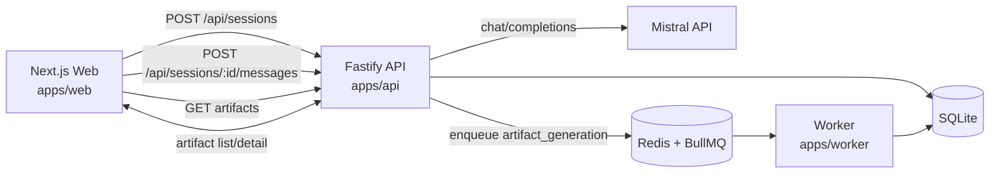

# Architecture — The Architect (MVP)

## High-Level Flow
```txt
Browser (mic + UI)
  -> API (session/orchestration)
    -> Mistral Large (reasoning + structured response)
    -> BullMQ enqueue (artifact generation)
      -> Worker processes artifact job
        -> SQLite stores artifacts/session state
  <- API JSON responses back to Browser
```

## Architecture Diagram (Mermaid)


## Components

### 1) Web App (`apps/web`)
- Captures voice input via browser speech API
- Sends text/voice transcript messages
- Displays assistant response + artifact list/detail
- Handles mode switching (Architect/Planner/Pitch)

### 2) API Service (`apps/api`)
- Session management
- Message intake endpoint
- Mistral orchestration + schema validation
- Queue producer for artifact generation jobs

### 3) Worker Service (`apps/worker`)
- Consumes BullMQ jobs
- Generates artifact markdown + JSON payload
- Persists artifacts and job status in SQLite

### 4) Shared Packages
- `shared-types`: zod schemas + inferred TS types
- `core`: reusable DB/queue/mistral/artifact logic

## Queue Use Cases
- Artifact generation jobs
- Retry-safe async tasks without blocking API latency

## Storage (SQLite)
- sessions
- messages
- artifacts
- jobs

## MVP Reliability Rules
- Every endpoint returns typed JSON
- Model output validated against schema
- Failed jobs retry with exponential backoff
